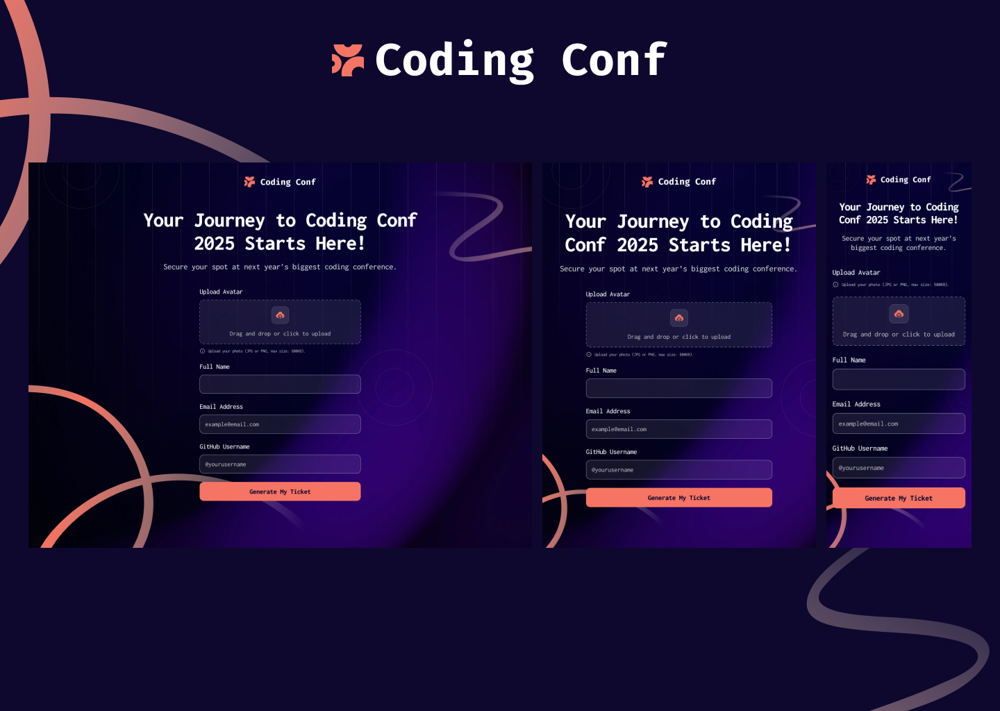

Generate your ticket for the next big coding conference 2025!

### Design

# Features List

- **Form Completion**  
  - Users can complete the form with their details.  

- **Form Validation Messages**  
  - Receive validation messages if:  
    - Any field is missed.  
    - The email address is not formatted correctly.  
    - The avatar upload is too big or in the wrong image format.  

- **Keyboard Accessibility**  
  - Users can complete the form using only their keyboard.  

- **Conference Ticket Generation**  
  - Users see the generated conference ticket upon successful form submission.  

- **Responsive Design**  
  - The interface layout adapts optimally to the user’s device screen size.  

- **Interactive States**  
  - Hover and focus states are visible for all interactive elements.

- **Example Ticket Gen**
    - Generate an example ticket to see what it could look like.

### Ticket 

### Live Preview

Preview the site -> [coding conf](https://conf-ticket-gen.netlify.app)

### Built with

- Vite
- Reactjs
- Zustand - for state management
- TailwindCSS - for styling
- React Router v7 - for navigation